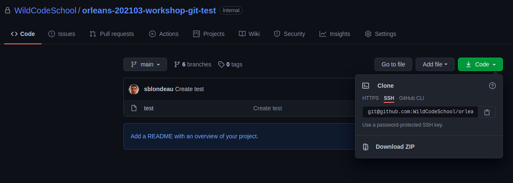
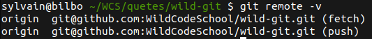

# Avant de commencer

```alert-warning
Bon à savoir : Tu auras besoin du projet créé lors de la ressource précédente pour poursuivre ton aventure.

[Voir la ressource "Git/GitHub 2 : Git en local"](https://simplonco.github.io/dev-web-git-github-2-git-en-local/)
```

# Introduction
Jusqu'à présent, tu as créé un fichier et apporté des modifications que tu as enregistrées localement avec git. En d'autres termes, ton chef-d'œuvre de programmation est, pour le moment, seulement accessible par le biais de ton ordinateur.

```alert-info
En 2020, Git, Github ainsi que d'autres acteurs du monde informatique ont décidé de remplacer tous les termes pouvant être associés à de la discrimination raciale de leurs terminologies : *master, whitelist/blacklist, etc*. Il est donc possible dans certaines ressources que le mot "master", soit utilisé au lieu de "main". Cela ne change rien au fonctionnement. Cela demande juste un peu de gymnastique cérébrale. 🤸
```

## Objectifs

* ✅ Découvrir et comprendre le concept de dépôt distant (remote repository)
* ✅ Relier un dépôt distant à son dépôt local
* ✅ Connaître et comprendre les commandes de base liées aux dépôts distants telles que : clone, remote, push, pull, fetch, merge

## Contenu de la ressource

* Le dépôt distant
* La connexion SSH
* Les URL de dépôts
* Paramétrage d'un dépôt distant
* Envoyer du code vers ton dépôt distant
* Récupérer du code depuis le dépôt distant
* Cloner un dépôt

# Le dépôt distant

Un dépôt distant est un dépôt git (repository) qui n'est pas sur ton ordinateur.

Travailler sur un dépôt local est en général beaucoup plus pratique. Mais à un moment donné, tu dois envoyer ton code vers un dépôt distant pour :

* Enregistrer tes modifications sur un serveur (en cas de crash de ta machine locale)
* Partager ton code avec tes collègues

Avant de comprendre comment cela se fait, tu devras comprendre ce qu'est un dépôt distant.

Il existe plusieurs plateformes pour l'hébergement de tes travaux à distance, en voici quelques-unes

* [GitHub](https://github.com)
* [Bitbucket](https://bitbucket.org)
* [Gitlab](https://gitlab.com)

Tu peux également créer ton propre serveur git avec ou sans interface d'administration web (ce que nous ne ferons pas dans la ressource).

# Avant toute chose : la connexion SSH

GitHub a récemment modifié sa politique concernant les questions de sécurité. Ainsi, depuis le 13 août 2021, il est obligatoire d'utiliser une authentification de type "SSH" lors de l'utilisation de git en coordination avec GitHub.

SSH (Secure Shell) est un protocole permettant par exemple d'ouvrir un shell à distance (mais pas seulement) avec de forts objectifs de sécurité. Parmi ces objectifs, SSH assure une authentification par clés cryptographique.
La page WikipediA sur [SSH](https://fr.wikipedia.org/wiki/Secure_Shell) permet d'en savoir un peu plus sur ce protocole.

## Création de clés SSH dans GitHub

Pour cela, tu dois donc en premier lieu créer une paire de clés SSH. Tu peux le faire "à la main", mais pour simplifier la configuration, Github te propose une solution pratique, via l'utilisation de Github CLI (un outil en ligne de commande propre à Github, à ne pas confondre avec git !). Github CLI permet de faire beaucoup de chose depuis ton terminal, notamment de configurer la clé SSH.

```alert-warning
Attention de bien suivre les étapes en fonction de votre système d'exploitation.
```

### Installation de Github CLI

````tabs
!--- Ubuntu
Tape simplement cette commande
```sh
sudo apt install gh
```

!--- Mac OS
Tape simplement cette commande
```sh
brew install gh
```

!--- Windows
Va sur la page https://github.com/cli/cli/releases/
Dans la catégoie "Assets", télécharge le "windows amd64 installer" (tu devras peut-être cliquer sur "Afficher tous les assets" pour le trouver) et exécute le.
````

### Configuration de la clé SSH via github CLI

Suit uniquement l'étape 2 (**Step 2 - Authentication**) de la documentation ci-dessous (la partie 1 traite de l'installation mais tu viens déjà de le faire).

**Tuto sur la configuration d'une clé SSH via la CLI**

[https://blog.devgenius.io/getting-started-with-the-github-cli-2a723585e368#552e](https://blog.devgenius.io/getting-started-with-the-github-cli-2a723585e368#552e)
{:.alert-info}

> #### 💡 Alternative
> Si ça ne marche pas, la documentation de GitHub te donne des instructions pour configurer à la main ta clé SSH, dans les sections "Generating a new SSH key" et "Adding your SSH key to the ssh-agent". Tu n'as **pas besoin de suivre** cette ressource si tu as configuré la clé via Github CLI.
>
> **[Alternative] Tutoriel sur GitHub pour la création d'une paire de clés SSH à la main**
>
> [https://docs.github.com/en/github/authenticating-to-github/generating-a-new-ssh-key-and-adding-it-to-the-ssh-agent](https://docs.github.com/en/github/authenticating-to-github/generating-a-new-ssh-key-and-adding-it-to-the-ssh-agent)
{:.alert-info}

Tu peux enregistrer plusieurs clés SSH sur ton compte GitHub. Par exemple, si tu utilises git et GitHub sur plusieurs machines différentes, alors il te faudra répéter ces instructions sur chacun de tes ordinateurs, afin qu'ils aient tous leurs propre clés SSH liées à ton compte GitHub.
{:.alert-info}

# Paramétrage d'un dépôt distant

Pour envoyer ton travail à un dépôt distant (*remote*), tu dois d'abord informer ton dépôt local de l'existence du dépôt distant.

```bash
git remote add origin <REMOTE_URL>
```

> #### 💡 Explication
> Dans cette commande, "origin" est ton nom de dépôt distant et est associé à une URL. C'est un nom conventionnel comme un autre, mais nous aurions très bien pu en choisir un autre.
>
> Pour `<REMOTE_URL>`, chaque dépôt GitHub possède en réalité deux types d'adresses, une HTTPS et une SSH. Tu peux les retrouver en cliquant sur le bouton vert "Code", comme indiqué sur la capture ci-dessous
>
> 
>
> Même si c'est l'adresse en HTTPS apparait en premier, tu ne l'utiliseras pas ! Tu dois cliquer sur SSH et utiliser l'adresse commençant par git@github... c'est elle qui est compatible avec la configuration de la clé SSH que tu as fais dans l'étape précédente.
>
> **Authentification SSH**
>
> [https://www.ssh.com/ssh/public-key-authentication](https://www.ssh.com/ssh/public-key-authentication)
{:.alert-info}

Voilà ! Ton dépôt à distance est lié à ton dépôt local (pour fetch et push). Tu peux le vérifier en exécutant la commande suivante à tout moment.

```bash
git remote -v
```



* **Fetch** : Pour récupérer ton travail du dépôt distant vers le local.
* **Push** : Pour envoyer ton travail du local vers le distant.

# Envoyer du code vers ton dépôt distant

Pour envoyer du code vers le dépôt distant, on utilise la commande *push*.

La commande push met à jour le dépôt distant avec le contenu des derniers commits locaux non envoyés.

```
git push origin main
```

Dans cette commande, `origin` est le lien vers le dépôt distant. `main` est ici le nom de la branche distante vers laquelle nous voulons *push*.

Pas d'inquiétude, tu découvriras le concept de **branches** dans la ressource suivante. Pour le moment, tu peux considérer une branche comme un ensemble de lignes de code (d'un même thème). Une branche possède un nom unique et "main" est la branche par défaut.

# Récupérer du code depuis le dépôt distant

Si ton dépôt à distance comporte des modifications et que tu souhaites les récupérer en local, tu utiliseras la commande *pull*.

```bash
git pull origin main
```

Il s'agit d'un raccourci, la commande "pull" est en fait un "fetch" puis un "merge".

C'est l'équivalent de :

```bash
git fetch origin
git merge origin/main
```

* La commande "fetch" permet de récupérer localement la branche distante.
* La commande "merge" fusionne la branche distante et la branche locale (tu verras comment fusionner dans une ressource ultérieure).

Il est important de comprendre que tu as une copie des deux branches (distante et locale) sur ton ordinateur.

Git ne fonctionne que localement, tu dois donc lui demander de fusionner la branche distante nommée *main* de *origin* avec la branche locale sur laquelle tu es *main*.

# Cloner un dépôt

Si tu as déjà un dépôt distant (un projet existant qui comprend un peu de code), tu peux récupérer le projet localement avec la commande *clone* :

```bash
git clone <REMOTE_URL>
```

Cela permettra de récupérer le projet distant localement dans un nouveau dossier et de lier local et distant correctement par la même occasion.

Si tu ajoutes un dossier dans la ligne de commande (c'est facultatif), tu récupéreras le code source dans ce dossier spécifique.

Une courte vidéo pour résumer :

[Voir la vidéo YouTube](https://www.youtube.com/watch?v=s6KTbytdNgs)

# En résumé

* Un dépôt distant est un dépôt git hébergé sur Internet.
* Tu peux envoyer tes changements locaux sur ton dépôt distant avec la commande *push*.
* Tu peux récupérer les modifications du dépôt à distance grâce à la commande *pull*.
* Tu peux télécharger un projet existant avec la commande "clone".

- - -

# Quiz


[{"question": "La notion de dépôt distant (remote) n'existe que sur GitHub ?", "options": ["Vrai", "Faux"], "correct": 1}, {"question": "Quelle commande git permet de s'assurer que son dépôt local est à jour ?", "options": ["git pull", "git push", "git remote", "git clone", "git fetch & git merge"], "correct": [0, 4]}, {"question": "Comment créer un dépôt local à partir d'un dépôt distant ?", "options": ["git init <REMOTE_URL>", "git clone <REMOTE_URL>", "git pull <REMOTE_URL>"], "correct": 1}, {"question": "Quelle commande permet de récupérer les URL des dépôts distants configurés sur un dépôt local ?", "options": ["git remote -v", "git status", "git list <REMOTE_URL>"], "correct": 0}]



- - -

# 💪 Challenge

1. Crée un nouveau dépôt nommé "my-awesome-project" sur GitHub (coche "Initialiser ce dépôt avec un README").
2. Clone ce dépôt sur ton ordinateur à partir du lien SSH dans GitHub
3. Modifie le fichier README directement sur GitHub pour inclure une courte description du projet (par exemple : This awesome project is created to experiment git notions like clone, push and pull)
4. Récupère les modifications distantes sur ton projet local
5. Modifie sur ton ordinateur le fichier README en ajoutant une section appelée *achievements*. Remplis-la avec le texte "J'ai réussi à faire clone, pull et je m'apprête à faire push".
6. En utilisant le terminal, envoie (*push*) tes modifications vers le dépôt distant.
7. Partage le lien du dépôt distant en solution à ce défi.

# 🧐 Critères de validation

* [ ] Le dépôt distant contient un fichier README.md
* [ ] Ce fichier a été modifié par au moins 2 commits
